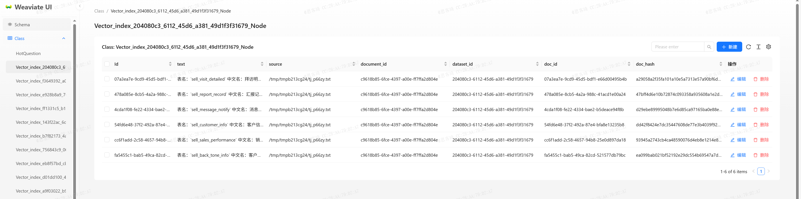

# Weaviate-UI




Weaviate-UI is a web client for interacting with the Weaviate.

## Features

- Schema query
- Data search
- Add Crud Operation
## Usage

```bash
$ docker run -e WEAVIATE_URL=http://localhost:8091 -e WEAVIATE_API_KEYS=secret crpi-fxp2tnj34354v68i.cn-heyuan.personal.cr.aliyuncs.com/ughost-docker/weaviate-ui:v2
```

